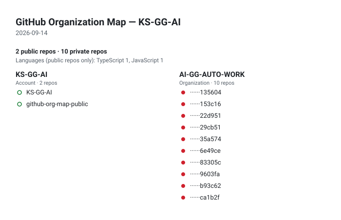

# github-org-map-public

  <a href="../../README.md">🇺🇸 English</a> ·
  <a href="./ko.md">🇰🇷 한국어</a> ·
  <a href="./zh-CN.md">🇨🇳 中文</a> ·
  <a href="./es.md">🇪🇸 Español</a> ·
  <a href="./hi.md">🇮🇳 हिन्दी</a> 
  <a href="./ar.md">🇸🇦 العربية</a> ·
  <a href="./pt-BR.md">🇧🇷 Português</a> ·
  <strong>🇷🇺 Русский</strong> ·
  <a href="./fr.md">🇫🇷 Français</a> ·
  <a href="./id.md">🇮🇩 Bahasa Indonesia</a>

## О проекте

Ежедневно обновляемая карта репозиториев аккаунта KS-GG-AI и организации AI-GG-AUTO-WORK. Публичные репозитории показаны под настоящими именами, приватные — только скрытыми метками, а некоторые не показываются вовсе. Снимок каждого дня сохраняется в `history/` и собирается в анимированный GIF.

  

Настройка, секреты и детали workflow описаны в <a href="../../README.md">README на английском</a>.

## Контакты

Для вопросов, отзывов или идей о карте это самые понятные точки входа.

[Профиль GitHub](https://github.com/KS-GG-AI) · [Репозиторий профиля](https://github.com/KS-GG-AI/KS-GG-AI) · [Открыть issue](https://github.com/KS-GG-AI/KS-GG-AI/issues/new)
